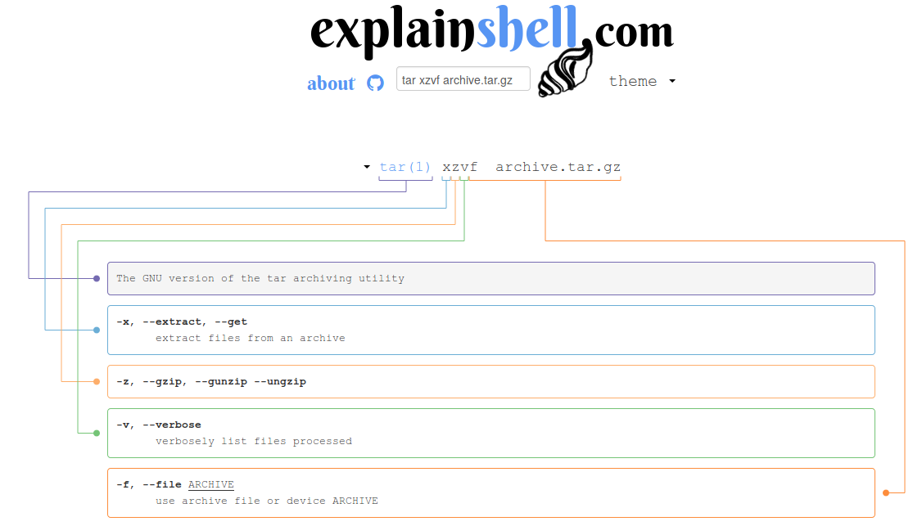

# De l'aide !

Une ligne de commande qui ne fonctionne pas ? Une manipulation de fichier non triviale ? Une option d'un programme oubliée ?

Chercher et trouver efficacement de l'aide est essentiel quand on travaille avec Unix. Les outils sont trop nombreux et trop complexes pour les connaître tous en détail.

## En ligne de commande

La plupart des commandes Unix disposent de l'option `--help` qui affiche les principales options et une description succincte de leur utilisation.

Par exemple avec la commande `cat` :
```
$ cat --help
Utilisation : cat [OPTION]... [FICHIER]...
Concaténer les FICHIERs vers la sortie standard.

Sans FICHIER ou quand FICHIER est -, lire l'entrée standard.

  -A, --show-all           équivalent à -vET
  -b, --number-nonblank    numéroter les lignes non vides en sortie, annule -n
  -e                       équivalent à -vE
  -E, --show-ends          afficher $ à la fin de chaque ligne
  -n, --number             numéroter toutes les lignes en sortie
  -s, --squeeze-blank      supprimer les lignes vides qui se répètent en sortie
  -t                       équivalent à -vT
  -T, --show-tabs          afficher les caractères TAB comme ^I
  -u                       (ignoré)
  -v, --show-nonprinting   utiliser les notations ^ et M-, sauf pour LFD et TAB
      --help     afficher l'aide et quitter
      --version  afficher des informations de version et quitter

Exemples :
  cat f - g  Afficher le contenu de f, suivi de l'entrée standard, puis du contenu de g.
  cat        Copier l'entrée standard vers la sortie standard.

Aide en ligne de GNU coreutils : <http://www.gnu.org/software/coreutils/>
Signalez les problèmes de traduction de « cat » à : <traduc@traduc.org>
Documentation complète à : <http://www.gnu.org/software/coreutils/cat>
ou disponible localement via: info '(coreutils) cat invocation'
```

Une documentation plus exhaustive est fournie avec la commande `man`.

Voici un exemple avec `sed`. La commande `man sed` renvoie :

```
SED(1)                           User Commands                          SED(1)

NAME
       sed - stream editor for filtering and transforming text

SYNOPSIS
       sed [OPTION]... {script-only-if-no-other-script} [input-file]...

DESCRIPTION
       Sed  is a stream editor.  A stream editor is used to perform basic text
       transformations on an input stream (a file or input from  a  pipeline).
       While  in  some  ways similar to an editor which permits scripted edits
       (such as ed), sed works by making only one pass over the input(s),  and
       is consequently more efficient.  But it is sed's ability to filter text
       in a pipeline which particularly distinguishes it from other  types  of
       editors.

       -n, --quiet, --silent

              suppress automatic printing of pattern space

       -e script, --expression=script
```

Il est possible de naviguer dans cette documentation avec les flèches haut et bas.

La touche `Q` permet de quitter la documentation.

La touche `/` suivie d'un motif à chercher puis de la touche `Entrée` va
lancer une recherche dans la documentation. L'appuie sur la touche `n` va aller
au motif suivant alors que `N` va revenir en arrière.


## Sur internet

Obtenir de l'aide sur internet est très simple mais il faut savoir où et comment chercher.

### Moteur de recherche et site de référence

En premier lieu, entrez dans votre moteur de recherche préféré les mots clefs correspondants à votre problème ou à l'erreur que vous avez rencontré. Généralement, vous obtiendrez plus de réponses sur une requête en anglais qu'en français.

Si votre question a trait à la programmation ou à Unix / Linux, il est très probable que les premières réponses pointent vers le site de questions / réponses [Stack Overflow](https://stackoverflow.com/) ou [Stack Exchange](https://stackexchange.com/) (le premier faisant partie du [second](https://stackexchange.com/sites)).

Si votre question est liée à la bioinformatique, le site de référence est [Biostars](https://www.biostars.org/). Pour des questions plus spécifiques au séquençage haut débit, le site [SEQanswers](http://seqanswers.com/) est aussi très pertinent.

### Quelques règles

Pour obtenir de l'aide sur internet, notamment sur les sites de questions / réponses, il faut respecter quelques règles.

La plus importante est sans doute qu'il faut être capable d'expliquer clairement le problème rencontré. La page [What Do You Mean “It Doesn't Work”?](https://meta.stackexchange.com/questions/147616/what-do-you-mean-it-doesnt-work) explique cela. L'article [Ten Simple Rules for Getting Help from Online Scientific Communities](http://journals.plos.org/ploscompbiol/article?id=10.1371/journal.pcbi.1002202) précise les règles à respecter :

1. Do Not Be Afraid to Ask a Question
2. State the Question Clearly
3. New to a Mailing List? Learn the Established Customs before Posting
4. Do Not Ask What Has Already Been Answered
5. Always Use a Good Title
6. Do Your Homework before Posting
7. Proofread your Post and Write in Correct English
8. Be Courteous to Other Forum Members
9. Remember That the Archive of Your Discussion Can Be Useful to Other People
10. Give Back to the Community

### explainshell

Le site [explainshell](https://explainshell.com/), comme son nom l'indique va
détailler les options d'une commande Unix.

Voici un exemple pour la commande `tar xzvf archive.tar.gz` :


