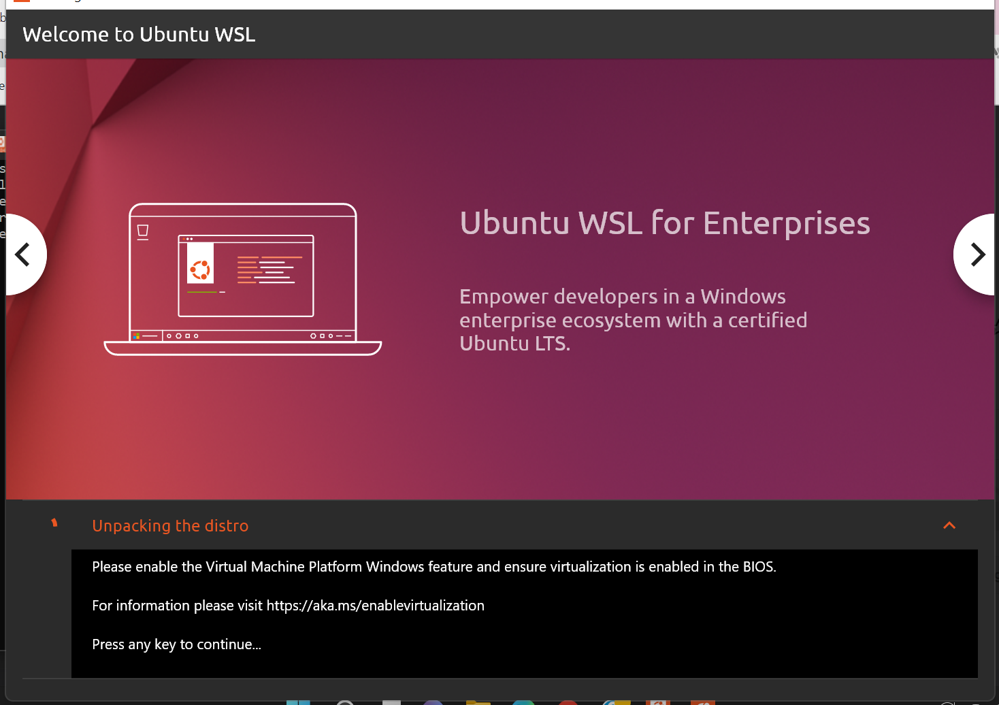

# Windows Sublsystem for Linux (WSL)

Le *Windows Subsystem for Linux* ou WSL est un moyen d'installer Linux dans Windows 10 et 11. Nous conseillons d'installer WSL plutôt qu'un Linux dans une machine virtuelle car c'est plus rapide et vous pouvez faire la plupart des choses comme dans un vrai OS Linux.

Dans cette page sont décrits les diverses opérations que j'ai pu noter pour  l'installation de WSL sous Windows 10 et 11, ainsi que divers outils utiles en bioinformatique notamment structurale.

## I) Installation de WSL

- Une Vidéo très bien faite :
[Installer le shell Bash Linux sous Windows 10 avec WSL (2020)](https://www.youtube.com/watch?v=CyG16N3GJWo)

---> A privilégier. **Attention**, lors de l'installation, on vous demande votre nom d'utilisateur et un mot de passe (mdp). Bien retenir votre mdp car on en aura besoin + tard.

- Un site un peu + vieux mais avec qqs infos intéressantes
[Everything You Can Do With Windows 10’s New Bash Shell (2018)](https://www.howtogeek.com/265900/everything-you-can-do-with-windows-10s-new-bash-shell/)

- En dernier recours (car plus technique !):
[Documentation officielle de Microsoft](https://docs.microsoft.com/fr-fr/windows/wsl/)

- Note pour les utilisateurs de Windows 11. Certains utilisateurs m'ont fait remonter le problème suivant lors de l'installation depuis le Microsoft Store :

{ width=40% }

Pour remédier à cela, il faut apparemment activer la "Virtual Machine Platform" comme expliqué dans cette [page](https://www.configserverfirewall.com/windows-10/please-enable-the-virtual-machine-platform-windows-feature-and-ensure-virtualization-is-enabled-in-the-bios/)

- Une fois installé, tapez "bash" dans la barre Windows. Cliquez sur le lien. Vous devriez avoir un shell bash WSL. Toutefois vous constaterez avec "pwd" qu'il ouvre ce shell dans le répertoire "/mnt/c/WINDOWS/system32"

- Pour faire en sorte d'arriver dans votre répertoire utilisateur /home/user (où user est votre nom d'utilisateur sous WSL), quand le bash est ouvert épingler le dans votre barre Windows. Une fois épinglé, faites un clic droit sur l'icône, puis faite un clic droit "Lanceur Bash Microsoft", cliquer sur "propriétés". Dans l'onglet Raccourci, modifier la ligne "C:\Windows\System32\bash.exe" par "C:\Windows\System32\bash.exe ~".

- Recliquez sur l'icône et faites un "pwd", vous devriez être dans votre home.

- Vous pouvez aussi avec "propriétés" régler tout un tas de choses dans votre shell (police, couleur de fond, etc.)

- Si vous êtes prêt.e. à aller plus loin, il y a aussi le [terminal Windows](https://docs.microsoft.com/fr-fr/windows/terminal/install) qui permet de piloter un shell bash et qui est très puissant.


## II) Mises à jour des paquets + installation de programmes de base

Tapez dans le shell :

```
sudo apt update
sudo apt upgrade 
```

(répondre oui aux questions, soyez patient, ça peut prendre du temps)

Ensuite pour installer un (ou plusieurs) programme(s) :

```
sudo apt install gedit
```

Je vous conseille d'installer les paquets suivants :

```
sudo apt install emacs pymol r-base-core grace
```

Pour chercher un paquet:

```
apt search nom_paquet
```

## III) Pouvoir ouvrir une fenêtre 

Télécharger et installerr VcXsrv
https://sourceforge.net/projects/vcxsrv/

--> cela installera une icône XLaunch sur le bureau
--> cliquez sur XLaunch sélectionnez "Multiple Windows", puis "Start no client", dans les "Extra Settings" ne touchez à rien, puis "Terminer". Vous devriez avoir une petit icône X montrant que le système X-Windows permettant d'ouvrir des fenêtres dans le WSL.

Pour essayer si ça fonctionne, tapez :

```
gedit
```

Vous devriez avoir gedit qui s'ouvre dans une fenêtre à part.

Si cela ne fonctionne toujours pas :

```
nano ~/.bashrc 
```

Ajouter à la fin de ce fichier la ligne :

```
export DISPLAY=0.0
```

Enregistrer et quitter le shell. Refaire le test avec gedit.

Certaines personnes sous Windows 11 m'ont fait part que cela ne passait pas. Si c'est le cas, vous pouvez essayer avec la ligne export suivante :

```
export DISPLAY=localhost:0.0
```


## IV) Voir Windows ds WSL, copier un fichier de Windows vers WSL ou WSL vers Windows

`/mnt/c` donne accès au disque C: de Windows.
`/mnt/d` donne accès au disque D: de Windows.
etc.

- Exemple: copier "fichier" du bureau Windows vers le répertoire courant de WSL (ici l'utilisateur sous Windows s'appelle "NomUserWindows")
```cp /mnt/c/Users/NomUserWindows/Desktop/fichier .```

- Exemple: copier "fichier" depuis le dossier Downloads de Windows dans le répertoire courant de WSL (parfois appelé Téléchargements)
```cp /mnt/c/Users/Pat/Downloads/fichier .```

- Exemple: copie de "fichier" dans WSL vers Windows (à la racine du disque D:)
```cp fichier /mnt/d/fichier .```


## V) Voir WSL dans Windows

Ici l'utilisateur sous Windows s'appelle `NomUserWindows`.
Ici l'utilisateur sous WSL s'appelle `user`.

Ouvrir un explorataur Windows. Le chemin vers WSL est :

`C:\Users\NomUserWindows\AppData\Local\Packages\CanonicalGroupLimited.UbuntuonWindows_79rhkp1fndgsc\LocalState\rootfs\home\user`

Attention, il se peut que `79rhkp1fndgsc` soit différent sur votre système

Sur les versions récentes de WSL, on peut mettre dans la barre d'adresse de l'explorateur Windows :

```
\\wsl$
```

--> Cela fait arriver dans le `/` du WSL.

Si vous ouvrez un répertoire WSL avec l'explorateur Windows, vous pouvez par exemple ouvrir un pdf ou un fichier texte en lecture seule. Mais surtout ne glissez pas d'icône dans ce répertoire WSL !!! 


## VI) Conseils importants

1) Pour copier un fichier de Windows vers WSL, **toujours privilégier** la méthode IV). Ne jamais glisser une icône avec l'explorataur Windows vers un répertoire WSL.

2) Eviter à tout pris d'éditer / modifier un fichier WSL avec un outil Windows et vice versa (ne jamais éditer un fichier Windows avec un outil WSL), seulement faire des copies entre les 2 avec la méthode IV).

3) Ouvrez le fichier .bashrc dans votre répertoire home, ajouter à la fin ces 3 lignes :

```
alias rm='rm -i'
alias mv='mv -i'
alias cp='cp -i'
```

Enregistrez le fichier, quittez le shell et ré-ouvrez en un nouveau. Ces 3 lignes feront en sorte de vous demander une confirmation si vous voulez écraser ou détruire un fichier.

Pour éviter cette demande de confirmation ultérieure, utilisez :

```
rm -f blabla
```

Attention, l'option `-f` force la destruction sans vous demander !!!

4) Surfer sur WSL ? Télécharger un programme et le transférer sur WSL.

Il n'y a pas de navigateur sur WSL. Pour surfer, faites le sous Windows. Si vous voulez télécharger un programme pour le WSL, téléchargez le programme sous Windows. Vraisemblablement, il arrivera dans le dossier `Downloads` de Windows.

Ensuite vous pourrez le copier comme on a vu ci-dessus :

```
cp /mnt/c/Users/Pat/Downloads/programme .
```

5) Changer les droits

Quand on copie un fichier de Windows vers WSL, il a les droits 755 par défaut. JE vous conseille de les changer tout de suite par les droits standard Unix. 

Par Exemple (`$ ` correspond à l'invite de commande) : 

```
$ cp /mnt/c/Users/Pat/Desktop/Loschwitz.pdf .
$ ls -l Loschwitz.pdf
-rwxr-xr-x 1 fuchs fuchs 9.8M Feb 13 19:52 Loschwitz.pdf
$ chmod 644 Loschwitz.pdf
$ ls -l Loschwitz.pdf
-rw-r--r-- 1 fuchs fuchs 10174470 Feb 13 19:52 Loschwitz.pdf
```

Ce n'est pas une obligation, mais c'est plus propre niveau Unix !


## VII) Installation de VMD

VMD vous permet de regarder des molécules et des trajectoires de dynamique moléculaire

Télécharger la dernière version (Version 1.9.4 LATEST ALPHA) sur le [site de VMD](https://www.ks.uiuc.edu/Research/vmd/)

Choisissez "LINUX_64 OpenGL, CUDA, OptiX, OSPRay"

Créer un répertoire tools dans lequel on installera tous les programmes

```
mkdir tools
cd tools
```

On désarchive l'archive et on va dans le rep :

```
tar -zxvf vmd-1.9.4a38.tgz
cd vmd-1.9.4a38
```

On lance la config et l'install

```
./configure LINUXAMD64
cd src
sudo make install
```

Ensuite on peut tester vmd :

```
vmd
```

Cela devrait lancer la fenêtre VMD.


## VIII) Installation GROMACS

Se déplacer dans le répertoire "tools"

```
cd ~/tools
```

Ensuite télécharger GROMACS :

```
wget http://ftp.gromacs.org/pub/gromacs/gromacs-2018.5.tar.gz
```

Ensuite désarchiver, aller dans le rep de GROMACS et créer un rep pour le compiler :

```
tar -zxvf gromacs-2018.5.tar.gz
cd gromacs-2018.5
mkdir build
cd build
```

Ensuite on configure et on compile :

```
cmake .. -DGMX_BUILD_OWN_FFTW=ON -DCMAKE_INSTALL_PREFIX=/usr/local/gromacs-2018.5
make -j 4
```

Et on installe :

```
sudo make install
```

Ensuite on teste si GROMACS est bien installé :

```
source /usr/local/gromacs-2018.5/bin/GMXRC
gmx -h
```

Et là on doit avoir la commande qui se lance avec tout un tas d'infos avec à la fin un message rigolo :

```
$ gmx -h
                         :-) GROMACS - gmx, 2018.5 (-:

                            GROMACS is written by:
     Emile Apol      Rossen Apostolov      Paul Bauer     Herman J.C. Berendsen
    Par Bjelkmar    Aldert van Buuren   Rudi van Drunen     Anton Feenstra
  Gerrit Groenhof    Aleksei Iupinov   Christoph Junghans   Anca Hamuraru   
[...]
Additional help is available on the following topics:
    commands    List of available commands
    selections  Selection syntax and usage
To access the help, use 'gmx help <topic>'.
For help on a command, use 'gmx help <command>'.

GROMACS reminds you: "Stop Drinking My Beer !" (The Amps)
```
